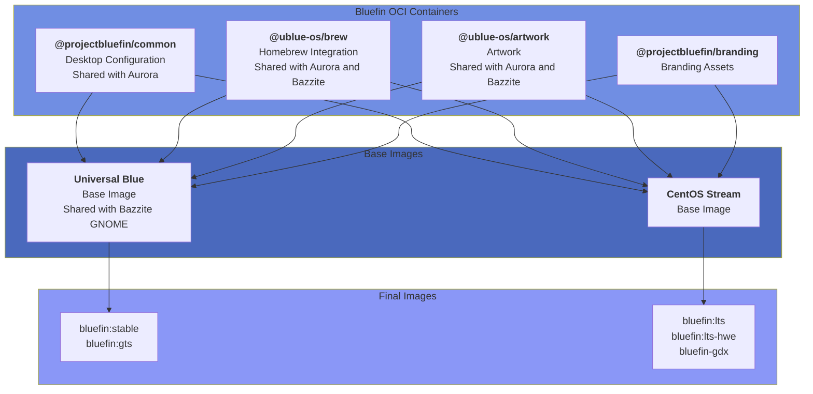

Greetings Guardians!

It's been a little over a month since our [December State of the Raptor](https://docs.projectbluefin.io/blog/bluefin-2025), and I wanted to give you an update on where we are. The short version: the architectural consolidation we promised in December is complete, and we're three weeks away from the most significant user-facing change in Bluefin's history - the GTS merge. Let's dive in!

:::warning

Bluefin GTS will be merged into Bluefin on the week of March 1st, 2026, see below for more information!

:::

Also check out:

- [Bluefin 2025 Wrap-up: State of the Raptor](https://docs.projectbluefin.io/blog/bluefin-2025) - December's comprehensive update
- [Bluefin Autumn 2025](https://docs.projectbluefin.io/blog/2025-10-28-bluefin-autumn/) - October's update
- [Automated reports and changelogs](https://docs.projectbluefin.io/blog/automated-reports-changelogs) - Our new transparency system
- [Modernizing custom images](https://docs.projectbluefin.io/blog/modernizing-custom-images) - The finpilot template

## How Was January?

January was our consolidation month. The OCI refactoring we detailed in December's State of the Raptor is no longer a future state - it's how Bluefin works today. We completed 148 items across the project (36 planned, 112 opportunistic), with contributions from 23 people including 10 new contributors. This is the kind of organic growth that makes open source work.

The big news is that [@projectbluefin/common](https://github.com/projectbluefin/common) is fully operational and serving all Bluefin variants - Bluefin stable, Bluefin GTS, Bluefin LTS, and Dakota are all consuming the same core OCI containers. We also launched our monthly reporting system, publishing [Jurassic January](https://docs.projectbluefin.io/reports/2026/01) on February 1st. This gives everyone visibility into what's happening across the entire project.

From an automation perspective, we processed 393 total PRs in January, with 62.3% (245 PRs) being automated bot updates. The Homebrew tap ecosystem continues to mature with 75 automated version bumps - 31 in the production tap, 44 in the experimental tap. Build health remains solid across all variants with 423 builds and success rates hovering between 97-100% for most images. Average build time across all variants: 32 minutes. The builds stay green, which is exactly where we want to be.

> JF's Bluefin desktop

## The OCI Refactoring - Mission Accomplished

In December we laid out the new architecture for Bluefin. Today, that's no longer a plan - it's production reality. Let me recap what we built and why it matters:

### What Changed

The bulk of what makes Bluefin "Bluefin" now lives in OCI containers that get composed together at build time:

- **[@projectbluefin/common](https://github.com/projectbluefin/common)** - Most of Bluefin's opinion on the distro experience lives here: ujust recipes, motd, service units, GNOME and CLI configuration, application choices. This is shared with Aurora so we maintain consistency across images.
- **[@projectbluefin/branding](https://github.com/projectbluefin/branding)** - Branding assets that we don't want to clutter the common repo
- **[@ublue-os/artwork](https://github.com/ublue-os/artwork)** - Art assets repository, shared with Aurora and Bazzite
- **[@ublue-os/brew](https://github.com/ublue-os/brew)** and associated **[@ublue-os/homebrew-tap](https://github.com/ublue-os/homebrew-tap)** - Provides Homebrew itself and our selection of custom brew packages

This decoupling gives us some major wins that we're already seeing in production:

**Faster fixes everywhere.** In January, when we needed to fix the signing keys location, the change landed in common and instantly propagated to all variants. Same with the service unit improvements, the mise auto-install refinements, and the rollback helper enhancements. One fix, all images benefit.

**Parity issues resolved.** We were constantly fighting bugs where Bluefin had feature X but LTS didn't, or GTS was missing configuration Y. Those parity issues evaporated because everyone's consuming the same source. When translation contributors added Czech, French, and Polish localizations in January, they appeared everywhere simultaneously.

**Custom images are easier.** Check out Jorge's [finpilot template](https://docs.projectbluefin.io/blog/modernizing-custom-images) blog post. You can now assemble your own Bluefin-like experience by consuming these OCI containers just like we do. Want a COSMIC Bluefin? Consume common + cosmic-epoch. Want an Ubuntu Bluefin? Tulip already proved you can take Bluefin containers + ubuntu-bootc to make one. The production build system that makes Bluefin, Aurora, LTS, and Dakota is now accessible to anyone making custom images.

**Smaller, more maintainable codebases.** The individual image repositories (bluefin, bluefin-lts, dakota) are dramatically smaller now. They're mostly just Containerfiles that compose OCI layers. Maintenance happens in common, not spread across multiple repos.

We've already merged 183 PRs into common in January alone. The velocity is real, and it's sustainable because we're not duplicating work across repos anymore.

## Tracking Progress - The New Normal

On February 1st we launched something I'm really proud of: automated monthly reports. The first one, [Jurassic January](https://docs.projectbluefin.io/reports/2026/01), went live last week. If you haven't seen it yet, take a look - this is our new commitment to transparency.

Here's what we track every month:

**Planned Work** - Items tracked on our project board at [todo.projectbluefin.io](https://todo.projectbluefin.io). These are the things we're purposely organizing and executing on. In January: 36 items.

**Opportunistic Work** - Things people just work on day-to-day across all our monitored repositories. This is usually the bulk of the work because open source is fundamentally opportunistic. In January: 112 items.

**Homebrew Package Updates** - We track both the production tap and experimental tap separately. This tells you when packages get promoted and version bumps happen. In January: 31 production updates, 44 experimental updates.

**Build Health Metrics** - Success rates for all Bluefin image builders, month-over-month trends, total builds, average build times. We run 10 different build workflows and all of them get monitored. In January: 423 total builds, most variants at 97-100% success rate, average build time 32 minutes.

**Contributors** - Every person who merged a PR gets listed. New contributors get a gold foil usercard to celebrate their first contribution. In January: 23 total contributors, 10 new.

Why does this matter? Because you shouldn't have to dig through repos to understand what's happening. You shouldn't have to be on Discord 24/7 to know the project status. The monthly reports are the authoritative record of "what happened this month in Bluefin." They're automatically generated from our actual work, so they can't drift from reality.

Check [todo.projectbluefin.io](https://todo.projectbluefin.io) to see what's happening right now. Check the [monthly reports](https://docs.projectbluefin.io/reports/) to see what's already happened. This is the new normal for Bluefin transparency.

## Streamlining Bluefin Releases - T-Minus 3 Weeks

Now for the big one. As we announced in December, Bluefin GTS will merge into Bluefin on **March 1, 2026**. This is the most significant user-facing change since we launched GTS, and I want to make sure everyone understands what's happening.

:::warning

**March 1, 2026:** Bluefin GTS users will rebase to a Fedora 43 base and merge into the unified `bluefin:stable` tag.

**April 2026 (approximately):** All Bluefin users upgrade to Fedora 44 base, following the usual [CoreOS cadence](https://fedoraproject.org/coreos/).

:::

### What This Means

If you're on Bluefin GTS today, you'll receive an update during your normal update window the week of March 1st. Your system will move from the F42 base to an F43 base, and you'll be on the same track as current `bluefin:stable` users. About a month after that, everyone moves to F44 together. We're not doing zero-day upgrades - we follow the Fedora CoreOS release schedule, which means updates roll out gradually and safely.

Once this transition is complete, we'll have a proper gitops workflow: `next` → `testing` → `stable`. You'll be able to opt into newer versions at your leisure if you want to be on the bleeding edge, or stay on stable if you want maximum predictability. This has been working great in Bluefin LTS for months.

### Why We're Doing This

Maintaining two separate tracks (stable and GTS) was splitting our focus. Every fix had to be backported or forward-ported depending on which track needed it. Testing had to happen twice. Documentation had to explain the difference. It was overhead that didn't serve users.

With a single maintenance path, fixes ship faster. Features land everywhere simultaneously. The gitops workflow gives you control over upgrade timing without us having to maintain parallel branches. And for those who want the slower enterprise-grade cadence, that's what Bluefin LTS is for.

### Communication

We'll ramp up communication as March 1st approaches. Expect blog posts, Discord announcements, and documentation updates explaining exactly what to expect. If you have questions, ask them now - we want this transition to be as smooth as our F41 → F42 upgrades have been.

For full context on why we designed this workflow, check the [December State of the Raptor](https://docs.projectbluefin.io/blog/bluefin-2025) where we first announced the plan.

## Community & Contributors

January brought 23 contributors to the project, including 10 new faces. I want to call out some specific people and contributions because this is what makes Bluefin work:

**Translations:**

- [@ExistingPerson08](https://github.com/ExistingPerson08) added Czech translations to desktop files
- [@theMimolet](https://github.com/theMimolet) added French translations for Bazaar curations
- [@Micro856](https://github.com/Micro856) added Polish translations to curated.yaml

These might seem like small contributions, but they make Bluefin accessible to people who don't speak English natively. That matters.

**Bazaar Curations:**
Multiple contributors expanded our app curations: [@KiKaraage](https://github.com/KiKaraage) added Multiplication Puzzle to Education, Whis to AI & Machine Learning, Sitra and Embellish to font apps. These curations help newcomers discover great software.

**Homebrew Packaging:**
[@ahmedadan](https://github.com/ahmedadan) and [@inffy](https://github.com/inffy) led the charge on promoting packages from experimental to production. Three major promotions in January: goose-linux (AI agent), antigravity-linux (AI IDE), and linux-mcp-server (Linux admin MCP server). They're also driving the automated version bump workflows.

**Dakota Progress:**
[@alatiera](https://github.com/alatiera), [@jumpyvi](https://github.com/jumpyvi), [@hecknt](https://github.com/hecknt), and [@sideeffffect](https://github.com/sideeffffect) have been pushing Dakota forward with buildstream integration, boot support improvements, and VM generation scripts.

**Core Maintenance:**
[@tulilirockz](https://github.com/tulilirockz), [@renner0e](https://github.com/renner0e), [@hanthor](https://github.com/hanthor), and [@rwaltr](https://github.com/rwaltr) continue to be the backbone of day-to-day maintenance. In January alone, Tulip merged work across common, bluefin, bluefin-lts, and iso repositories. This is the unglamorous work that keeps the builds green and users happy.

### Metrics

Our [LFX Insights dashboard](https://insights.linuxfoundation.org/project/ublue-os-bluefin/contributors) shows we crossed the 3k weekly users milestone. We're not chasing vanity metrics, but it's validating to see steady organic growth.

Homebrew's 365-day stats show Bluefin at #11, Bazzite at #12, and Aurora at #15 in usage rankings. This confirms our bet on Homebrew as the CLI package manager for cloud-native Linux was the right call.

Flathub's [2025 year in review](https://flathub.org/en/year-in-review/2025) shows 20.3% year-over-year growth. Our bet on Flathub as the application delivery mechanism was also correct. Bazaar continues to improve the discovery and installation experience on top of Flathub's infrastructure.

## Dakota Update

Dakota (formerly "distroless" or "Dakotaraptor" in December's post) is our GNOME OS-based bootc image. The repository is at [@projectbluefin/dakota](https://github.com/projectbluefin/dakota) and development is active.

### What Landed in January

The team shipped a bunch of infrastructure work:

- **Buildstream skeleton** in [@projectbluefin/egg](https://github.com/projectbluefin/egg) - the build system behind GNOME OS
- **OSTree boot support** and initramfs modifications to enable bootc on GNOME OS foundations
- **VM and ISO generation scripts** so people can actually test this
- **QEMU flatpak compatibility** so you can run VMs without installing system packages
- **Experimental disk install** scripts for brave souls who want to test bare metal

### What This Enables

Dakota isn't for everyone and will offer the least amount of compromises. There's no system package manager at all - not even rpm-ostree. It's pure bootc. This gives us some benefits we can't get any other way:

- **systemd-boot, systemd-homed, and UAPI tech** ship immediately without waiting for Fedora to adopt them. We can finally say goodbye to grub forever!
- **Testing branches with development GNOME** so contributors can help upstream development
- **Direct collaboration with GNOME and systemd teams** - we're forging working relationships with critical upstreams instead of waiting for distributions to catch up

We're still on track for a Spring 2026 alpha release. It'll be VM-only initially. We're waiting for GNOME 50 to land, and then we'll establish the `next` → `testing` → `stable` workflow. The `next` branch will track nightly GNOME development builds for people who want to contribute upstream.

Don't worry, we won't call it "Distroless." The name Dakota is much better.

If you want to help, you don't even need to talk to us - go [talk to GNOME directly](https://os.gnome.org/). Dakota is about spending more time with the things you love (GNOME) and less time with the delivery service. We're mostly just waiting for GNOME 50, so patience is the main requirement right now.

## Refining the Bluefin Developer Experience

About 60% of you turn on Bluefin's [Developer Mode](https://docs.projectbluefin.io/bluefin-dx/). We purposely focus on developers and strive to deliver the world's best cloud-native development experience.

### Homebrew Ecosystem Maturity

The Homebrew tap ecosystem matured significantly in January:

**Production tap:** 31 automated version updates
**Experimental tap:** 44 automated version updates
**Total:** 75 version bumps via GitHub Actions

Three packages graduated from experimental to production:

- **goose-linux** - Open source, extensible AI agent ([PR #188](https://github.com/ublue-os/homebrew-tap/pull/188))
- **antigravity-linux** - AI Coding Agent IDE ([PR #199](https://github.com/ublue-os/homebrew-tap/pull/199))
- **linux-mcp-server** - MCP server for Linux system administration ([PR #221](https://github.com/ublue-os/homebrew-tap/pull/221))

Use `ujust bbrew` to browse and install these packages.

### Bold Brew Integration

Thanks to [Vito Castellano](https://github.com/Valkyrie00) from [Bold Brew](https://github.com/Valkyrie00/bold-brew), we have curated developer experiences that work on any Linux with Homebrew:

**[ide.Brewfile](https://github.com/projectbluefin/common/blob/main/system_files/shared/usr/share/ublue-os/homebrew/ide.Brewfile)** - VSCode, Codium, JetBrains Toolbox, nvim, helix, and micro

**[experimental-ide.Brewfile](https://github.com/projectbluefin/common/blob/main/system_files/shared/usr/share/ublue-os/homebrew/experimental-ide.Brewfile)** - Individual JetBrains products, Antigravity, and Cursor

Thanks to [flatpak support in brewfiles](https://docs.projectbluefin.io/blog/flatpak-support-in-brewfiles), we can ship all sorts of combinations now.

### AI/Machine Learning Tools (Bluespeed)

Our [AI toolset](https://github.com/projectbluefin/common/blob/main/system_files/shared/usr/share/ublue-os/homebrew/ai-tools.Brewfile) continues to expand:

- **goose** - The AI agent we promoted to production in January
- **Codex** - OpenAI's code generation CLI
- **Copilot CLI** - GitHub Copilot for terminal
- **Gemini** - Google's AI assistant CLI
- **LM Studio** - Run LLMs locally
- **Mistral Vibe** - Mistral AI's interface
- **Qwen Code** - Qwen's code-focused model
- **OpenCode desktop** - Added to experimental tap in January

:::info[Thanks Docker!]

You'll find the new [Docker model plugin](https://www.docker.com/blog/docker-model-runner-universal-blue/) included too. A huge shoutout to the folks at Docker for working with us!

:::

### Moving Forward

In 2026 we're working to eliminate the need for dedicated `-dx` images. The plan:

- IDEs unbundled from base images (use Homebrew instead)
- Containerd + Docker included in base images (no user configuration needed)
- More flexibility for users to choose their development stack

This is still a work in progress, so consider it a slow burn.

## Bluefin LTS Status

Here's the honest assessment of where LTS stands today:

**Latest release:** lts.20251223 (December 23, 2025)

**What's good:**

- Transition to common OCI containers complete (parity with mainline Bluefin)
- GNOME 49 components landing via CentOS Stream (nice LTS cadence)
- Hardware enablement (HWE) branches bring Fedora kernel (less falling behind)
- Secure boot support on HWE branches working
- Testing branch (lts-testing) launched for early adopters

**What needs work:**

- The tuned policy [still needs a fix](https://github.com/ublue-os/bluefin-lts/issues/841). You have to run a workaround to get power management working on laptops. This sucks. We know it sucks. We're working on it.

Despite the tuned policy papercut, this is the image I use on my work machines. The LTS-HWE branch has effectively replaced the Bluefin GTS use case by offering a relaxed desktop upgrade cadence with the Fedora kernel. Less churn, fewer regressions, still gets security updates. The new common OCI architecture will make fixing remaining issues much faster.

## Other Goodies

Here's the rapid-fire list of smaller updates:

### ISOs

- **Consolidated to [@projectbluefin/iso](https://github.com/projectbluefin/iso)** repository
- **Monthly refresh schedule active** - Fresh installation media every month
- **Anaconda web UI** now default installer (much better experience)
- **Local build scripts** available for testing
- **Multi-distro support** for Bluefin, LTS, and Dakota

### Powerwash

`ujust powerwash` is now in alpha and ready for testing. This wraps the `bootc install reset --experimental` command behind confirmation dialogs. Use this if you want to wipe your PC for donation or resale. BE CAREFUL - this erases everything! Check the [bootc documentation](https://bootc-dev.github.io/bootc/experimental-install-reset.html) for details.

### Documentation

- **Mise documentation improvements** by [@rwaltr](https://github.com/rwaltr) ([PR #577](https://github.com/projectbluefin/documentation/pull/577))
- **Powerwash command documentation** added ([PR #554](https://github.com/projectbluefin/documentation/pull/554))
- **SELinux devcontainer configuration** examples by [@leafyoung](https://github.com/leafyoung) ([PR #547](https://github.com/projectbluefin/documentation/pull/547))
- **Driver versions tracking automation** launched (weekly updates to docs/driver-versions.md)

### Upstream Engagement

- **bootc CNCF lifecycle progress** - We continue to collaborate with the bootc team as they navigate the [CNCF Project Lifecycle](https://contribute.cncf.io/projects/lifecycle/)
- **GNOME OS collaboration** - Direct working relationship with GNOME team on Dakota
- **Homebrew Linux improvements** - Ongoing engagement to make Homebrew better on Linux
- **Flathub ecosystem** - Working with Bazaar and Flathub on the next generation of app delivery

## Metrics

Let's look at the numbers that matter:

### Critical Upstreams

- **Flathub 2025:** 20.3% year-over-year growth ([report](https://flathub.org/en/year-in-review/2025))
- **Homebrew 365-day stats:** Bluefin (#11), Bazzite (#12), Aurora (#15) in usage rankings

We bet on the right horses. Flathub for applications, Homebrew for CLI tools. Both ecosystems are growing and healthy.

### Bluefin-Specific

From [LFX Insights](https://insights.linuxfoundation.org/project/ublue-os-bluefin/contributors):

- **Crossed 3k weekly users** milestone
- **January activity:**
  - 148 items completed (36 planned, 112 opportunistic)
  - 23 contributors (10 new)
  - 393 total PRs (62.3% automated)

### Build Health

From the [Jurassic January report](https://docs.projectbluefin.io/reports/2026/01):

- **423 builds** across all images in January
- **Success rates:** 97-100% for most variants
- **Average build time:** 32 minutes across all workflows
- **Most active:** Bluefin Stable (67 builds)

### Repository Activity

- **projectbluefin/common:** 183 PRs merged in January
- **ublue-os/homebrew-tap:** 31 version updates
- **ublue-os/homebrew-experimental-tap:** 44 version updates

Check our [Analytics page](https://docs.projectbluefin.io/analytics) for up-to-date charts and the [monthly reports](https://docs.projectbluefin.io/reports/) for detailed activity tracking.

## Development Roadmap(ish) - Updated

Here's where we stand on the timeline from December, with current status:

### ✅ Completed (January 2026)

- Bluefin LTS transition to common OCI containers
- Bluefin transition to common OCI containers
- Monthly reporting system launched
- ISO repository consolidated

### 🔄 In Progress (February 2026)

- Final polish on common OCI integration
- GTS merge preparation (March 1 deadline)
- Dakota alpha development

### ⏳ Upcoming

- **March 1, 2026:** Bluefin GTS merges into Bluefin (F43 base)
- **April 2026:** Bluefin F44 upgrade (all users, following CoreOS cadence)
- **Spring 2026:** Dakota alpha release (VM-only initially)
- **Ongoing:** Monthly refreshed ISOs, monthly transparency reports

### Conference Season 2026

The team will be at:

- [SCaLE 23x](https://www.socallinuxexpo.org/scale/23x) - Pasadena, California
- [KubeCon + CloudNativeCon Europe](https://events.linuxfoundation.org/kubecon-cloudnativecon-europe/) - Amsterdam, Netherlands
- [KubeCon + CloudNativeCon North America](https://events.linuxfoundation.org/kubecon-cloudnativecon-north-america-2026/) - Salt Lake City, Utah

:::tip[Easter Egg]

The key is: `lumina`

:::

Come say hello if you're attending! We'll have dinosaur stickers.

## How You Can Help

Bluefin is built by the community. Here's how you can contribute:

### For Users

- **Prepare for the GTS merge** on March 1st - read the documentation, ask questions if you have concerns
- **Test monthly ISOs** and provide feedback - help us catch issues before users hit them
- **Try Dakota VMs** when the alpha lands in Spring 2026
- **File issues** on [todo.projectbluefin.io](https://todo.projectbluefin.io) - transparency only works if we know what's broken

### For Developers

- **Try the [finpilot template](https://github.com/projectbluefin/finpilot)** for making custom images
- **Contribute to [@projectbluefin/common](https://github.com/projectbluefin/common)** - check the help wanted issues
- **Work on Homebrew for Linux** - help us make brew better on Linux platforms
- **Contribute to GNOME directly** - this helps Dakota and helps everyone using GNOME

### For Sponsors

These people make Bluefin possible:

- **[Kolunmi](https://github.com/sponsors/kolunmi)** - Bazaar developer
- **[Yulian Kuncheff](https://ko-fi.com/yulian)** - Homebrew integration
- **[Ahmed Adan](https://github.com/sponsors/ahmedadan)** - Homebrew packaging
- **[Delphic Melody](https://ko-fi.com/melodyofdelphi)** - Artwork vectorization and remastering

If you use Bluefin professionally, please consider sponsoring the people who make it work.

### For Everyone

- **Read the [monthly reports](https://docs.projectbluefin.io/reports/)** - stay informed about project progress
- **Join [Discord](https://discord.gg/f8MUghG5PB)** or the forums - get help, help others
- **Share Bluefin** with friends and coworkers who might benefit
- **Attend conferences** - meet the team, share your experience

## See You in 2026!

The consolidation phase is complete. We promised in December that we'd refactor Bluefin into composable OCI containers, and we delivered. March 1st brings the GTS merge - the most significant user-facing milestone ahead. Our new automated reporting system provides unprecedented transparency into project activity. The community is growing organically with 10 new contributors in January alone.

2026 is the year of execution. We've built the foundation. Now we refine it, ship Dakota, and continue iterating on the best cloud-native desktop experience we can build.

Thank you for being part of this journey. Thank you to every contributor who merged a PR, filed an issue, answered a question on Discord, or simply used Bluefin and provided feedback. Open source works because people show up.

The gathering of raptors continues.

### [Discussions](https://github.com/ublue-os/bluefin/discussions/)

Leave a comment or question!
