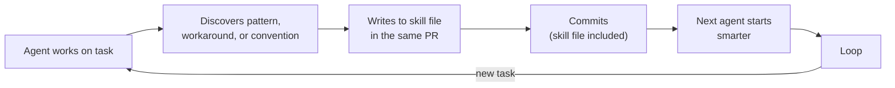
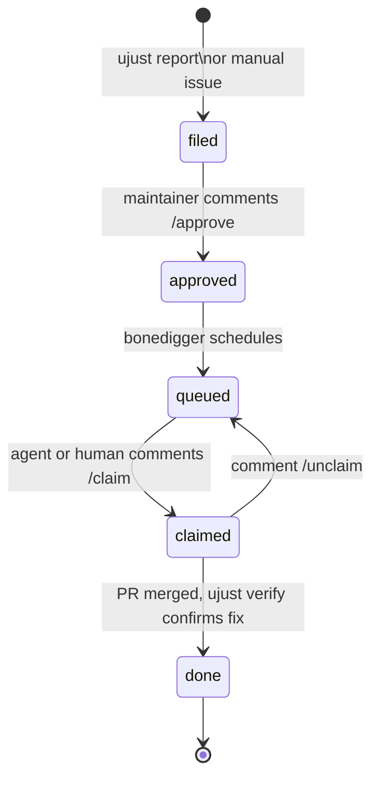

# Agentic Bluefin — Contributor Guide

:::info What this guide is for
This guide explains how to contribute to `projectbluefin` — an agentic-first reboot of the Bluefin project. If you are looking for the legacy contributing guide (the one that talks about forking `ublue-os/bluefin`), that is still available at [/contributing](/contributing). This guide describes how things work now.
:::

## What Changed and Why

Bluefin has been rebooted from `ublue-os/bluefin` — a community-maintained image built by humans — to `projectbluefin/bluefin`, a factory where AI agents implement work and humans approve design, security-sensitive changes, and merges.

The reboot took 4–5 days in late May 2026. As Jorge describes it:

> I did a 4-5 day sprint to rebuild Bluefin with agents. Lots of AI smart people helped me like Andy Anderson, who really explained this. Then it just became obvious. Bluefin 2.0.
>
> — Jorge Castro, *[THEPATTERN](https://github.com/projectbluefin/bluefin/blob/main/THEPATTERN.md)*

For a full technical comparison of what changed between `ublue-os/bluefin` and `projectbluefin/bluefin`, see **[THEPATTERN.md](https://github.com/projectbluefin/bluefin/blob/main/THEPATTERN.md)**.

---

## This Is an F1 Car, Not a Sedan

The agentic factory is fast and capable. It is also new, and in places it is not finished.

**What is operational as of 2026-06-02:**
- Keyless signing, merge queue, fast PR validation (1–2 min)
- `post-testing-e2e.yml` running against the testsuite
- `weekly-testing-promotion.yml` with 2-human Environment gate
- `projectbluefin/actions` shared CI library consumed by `bluefin` and `bluefin-lts`
- `bonedigger` issue lifecycle bot

**What is operational but currently unstable:**
- The post-testing e2e run **is failing** (testsuite stabilizing as of 2026-06-02). The promotion gate correctly blocked untested images — it is working as intended, but the tests themselves need work.
- Many test scenarios are tagged `@quarantine`: they are written and committed but not stable enough to gate promotion.

**What is deferred:**
- `projectbluefin/actions` consumption by `dakota` (tracked in [projectbluefin/actions#16](https://github.com/projectbluefin/actions/issues/16))
- ARM builds — wired in CI, disabled pending akmods ARM support

**What this means for you as a contributor:**

You will find rough edges. The system is intentionally moving fast. When something breaks, the correct response is to file an issue and fix it, not to conclude that the approach is broken. The design assumption is that the gates (2-human approval + e2e + SHA-lock) protect users even while individual components are still maturing.

---

## The System You Are Joining

Bluefin's agentic factory is orchestrated by **[KubeStellar Hive](https://kubestellar.io/live/hive/bluefin/)**, an AI-native continuous delivery system. The architecture looks like this:

```mermaid
flowchart TB
    subgraph hive["KubeStellar Hive — kubestellar.io/live/hive/bluefin/"]
        direction TB
        acmm["AI-native Continuous Maturity Model\nAI agents run at increasing autonomy levels"]
    end

    hive --> bonedigger
    hive --> kubestellar_bot

    subgraph bonedigger["bonedigger (projectbluefin/bonedigger)"]
        direction TB
        ujust["ujust report\n(user runs on their machine)"]
        bot["GitHub Actions lifecycle bot"]
        ujust --> bot
    end

    subgraph kubestellar_bot["kubestellar-bot (repo automation)"]
        direction TB
        picks["picks up queued issues"]
        dispatches["dispatches agents to implement"]
        ships["ships PRs back to image repos"]
        picks --> dispatches --> ships
    end

    bonedigger -->|files issues| image_repos
    kubestellar_bot -->|opens PRs| image_repos

    subgraph image_repos["Image Repositories"]
        direction LR
        bluefin["projectbluefin/bluefin\n(Fedora-based)"]
        lts["projectbluefin/bluefin-lts\n(CentOS-based)"]
        common["projectbluefin/common\n(shared OCI layer)"]
        dakota["projectbluefin/dakota\n(BuildStream / distroless)"]
    end

    image_repos -->|ships| loop["Better OS\n↓\nBetter bonedigger\n↓\nLoop"]
    loop -->|more reports| bonedigger

    style hive fill:#2d3a5a
    style bonedigger fill:#3a4a2a
    style kubestellar_bot fill:#4a3a2a
    style image_repos fill:#2a3a4a
```



### Components

**[KubeStellar Hive](https://kubestellar.io/live/hive/bluefin/)** is the orchestration layer. It manages 6 repositories in the `projectbluefin` org. You can watch it work in real time at [kubestellar.io/live/hive/bluefin/](https://kubestellar.io/live/hive/bluefin/).

**[bonedigger](https://github.com/projectbluefin/bonedigger)** is the client + lifecycle bot. On Bluefin systems, users run `ujust report` — the agent collects system diagnostics that are hard for humans to gather manually, scrubs PII on-device, and files an issue to the relevant image repository. The GitHub Actions lifecycle bot then manages the pipeline: `filed → approved → queued → claimed → done`.

**kubestellar-bot** is the repo automation layer. It picks up queued issues, dispatches agents to implement fixes and improvements, and ships them back as PRs against the `testing` branch.

**You** are a human in this system. Your work is approving design, reviewing agent PRs, deciding what to reject, and running the gates that machine enforcement cannot replace.

---

## About KubeStellar Hive and the AI Codebase Maturity Model

:::info Sources
The facts in this section come from primary sources. Read them rather than relying on this summary.

- Anderson, A. *The AI Codebase Maturity Model: From Assisted Coding to Fully Autonomous Systems.* [arXiv:2604.09388](https://arxiv.org/abs/2604.09388)
- CNCF blog (2026-05-14): [*When AI agents become contributors: How KubeStellar reached 81% PR acceptance*](https://www.cncf.io/blog/2026/05/14/when-ai-agents-become-contributors-how-kubestellar-reached-81-pr-acceptance/)
- The New Stack (2026): [*Beyond prompting: How KubeStellar reached 81% PR acceptance with AI agents*](https://thenewstack.io/ai-codebase-maturity-model/)
- [projectbluefin-dot-github/AGENTS.md](https://github.com/projectbluefin/.github/blob/main/AGENTS.md) — org operating model
:::

### Andy Anderson and the ACMM

KubeStellar Hive was designed by **Andy Anderson** — Senior Platform Engineer and Architect at IBM, chief maintainer of KubeStellar for 4 years, and CNCF Sandbox project steward. Hive is the reference implementation for his **AI Codebase Maturity Model (ACMM)**.

The ACMM describes how codebases evolve from basic AI-assisted coding toward fully autonomous systems. The model is structured around 5 progressive levels (arXiv:2604.09388), with a 6th "Fully Autonomous" level introduced for Hive in the paper's Section 5:

| Level | Name | Defining feedback loop |
|-------|------|------------------------|
| 1 | **Assisted** | AI as sophisticated autocomplete — no persistent context or artifacts |
| 2 | **Instructed** | Explicit preferences encoded in files (CLAUDE.md, AGENTS.md, copilot-instructions.md) yielding reproducible consistency |
| 3 | **Measured** | Test suites, coverage metrics, and continuous monitoring infrastructure provide quantitative evaluation |
| 4 | **Adaptive** | Automated responses close feedback loops — auto-tuning, dynamic prioritization, error triage |
| 5 | **Self-Sustaining** | The codebase becomes a living specification encoding policy and priorities; agents implement with minimal human intervention |
| 6 | **Fully Autonomous** | Hive — the reference implementation (introduced in paper §5) |

From the abstract:

> "Each level is defined by its feedback loop topology — the specific mechanisms that must exist before the next level becomes possible. You cannot skip levels, and at each level, the thing that unlocks the next one is another feedback mechanism."

The central finding of the paper:

> **"The intelligence of an AI-driven development system resides not in the AI model itself, but in the infrastructure of instructions, tests, metrics, and feedback loops that surround it."**

### Hive's reported metrics

The numbers below are from the **KubeStellar Console** case study in the ACMM paper and the CNCF blog — an 82-day measurement period on a separate project. They are not yet measured outcomes for Bluefin. Hive on Bluefin is reported as a first-week deployment with a *target* SLA, not a measured one.

| Metric | Value | Source |
|--------|-------|--------|
| PR acceptance rate | 81% | CNCF blog, arXiv |
| Code coverage | 91% across 12 shards | CNCF blog |
| CI/CD workflows | 63 | CNCF blog |
| Nightly test suites | 32 | CNCF blog |
| Bug-to-merged-fix | under 30 minutes | CNCF blog |
| PR throughput gain (Level 2 → Level 6) | 5× | arXiv abstract |
| Issue throughput gain (Level 2 → Level 6) | 37× | arXiv abstract |
| Hive Bluefin SLA target | < 30 min issue-filed to PR-merged | arXiv abstract |
| Hive Bluefin scope | 6 repositories | arXiv abstract |

Specific automations Hive performs (from CNCF blog): repository triage every 15 minutes; PR build monitoring every 60 seconds; error-recovery with exponential backoff; hourly analytics queries for error spikes.

Cross-agent memory continuity in Hive is handled by a system called **Beads** (arXiv abstract).

### A finding that is directly load-bearing for Bluefin

From the case study (CNCF blog):

> *"A flaky test in autonomous workflow is erosion of trust model."*

A single test with 85% reliability cascaded failures across the system. This is why the Bluefin testsuite uses `@quarantine` tags for scenarios that are written but not deterministic — a flaky gate is worse than no gate.

### How the ACMM maps to Bluefin's current implementation

| ACMM level | What it corresponds to in Bluefin |
|------------|-----------------------------------|
| Instructed | `AGENTS.md`, `docs/SKILL.md`, `.github/skills/` files in each repo |
| Measured | 255-scenario testsuite + 2-human production Environment gate |
| Adaptive | skill-drift check, skill-audit cron (Monday 09:00 UTC), Renovate automerge |
| Self-Sustaining / Fully Autonomous | Stated direction; current state is partial — see "F1 car" section above |

The human's role at every level is the same: decide what to build, decide what to reject, define what "good" means. Anderson's paper is explicit on this: "Human oversight remains the source of decisions about what to build, what to reject, and defining quality standards."

---

## The Four Gates — Where Humans Decide

Agents implement autonomously **except** at these four gates. Stop and request human input when you hit one. If you are a human contributor reviewing an agent PR, these are the moments your judgment is most needed.

| Gate | When it triggers | What to do |
|------|-----------------|------------|
| **Design Gate** | Architecture changes, new subsystem design, behavioral changes visible to users | Open a draft PR or issue with the proposal. Wait for explicit approval before building. |
| **Security Gate** | Auth, signing, supply chain, secrets handling, COPR/third-party sources | Stop. Post plainly what you found and what you are proposing. Do not implement until a maintainer approves. |
| **Breakage Gate** | Cross-repo breaking changes — removing/renaming inputs, changing defaults that affect consuming repos | Enumerate the affected repos. Open an issue before touching code. |
| **Merge Gate** | Final PR approval — always human | Agents do not approve their own PRs. Two distinct humans for production builds (machine-enforced). |

When in doubt, open a draft PR with your implementation and ask explicitly. The system prefers over-communication at gates to silent autonomous action.

---

## The Self-Improvement Loop

Every agent session is expected to produce two outputs:

1. **The work** — the PR, fix, or improvement.
2. **The learning** — what the agent discovered that a future agent should know.

Output 1 without Output 2 leaves the system no smarter. The loop only compounds if agents write back. As the org AGENTS.md states:



### What qualifies as a learning worth writing back

**Write it:**
- A workaround for an upstream bug (include component + issue link)
- A non-obvious pattern required for correctness
- A convention that is not obvious from the code
- Something discovered by trial and error

**Do not write it:**
- One-off task notes ("use commit message X for this PR")
- Obvious things any developer would know
- Ephemeral state ("currently broken, fix pending")

### Where skill files live

| You are working in | Write to |
|--------------------|----------|
| `projectbluefin/actions` | `docs/skills/` (Copilot CLI) AND `.github/skills/` (Cloud Agent) |
| Any other `projectbluefin` repo | That repo's `.github/skills/` — create if absent |
| Cross-cutting (affects multiple repos) | Local first, then open a propagation issue in `projectbluefin/actions` |

### What humans check in review

When reviewing an agent PR, verify:
- Did the agent commit a `.github/skills/` update in this same PR?
- Is the learning described in that update real and non-obvious?
- If a skill file exists for the area worked in, was it updated?

A PR that touches CI, build, or packaging without a skill file update is a yellow flag. The skill-drift check will post an advisory warning automatically; your job is to decide whether the omission is justified.

---

## Repo Map

### Core image repos

| Repo | Role | What humans contribute |
|------|------|----------------------|
| [projectbluefin/bluefin](https://github.com/projectbluefin/bluefin) | Main OS image (Fedora-based) | Design decisions, PR review, `testing`-branch fixes |
| [projectbluefin/bluefin-lts](https://github.com/projectbluefin/bluefin-lts) | LTS variant (CentOS Stream 10 / bootc) | Same; LTS-specific hardware or lifecycle concerns |
| [projectbluefin/common](https://github.com/projectbluefin/common) | Shared OCI layer — desktop config, ujust, GNOME opinions | Shared behavior that applies to all variants |
| [projectbluefin/dakota](https://github.com/projectbluefin/dakota) | Distroless prototype (Dakotaraptor, BuildStream) | Experimental; actions integration deferred |
| [projectbluefin/actions](https://github.com/projectbluefin/actions) | Shared CI library — 9 composite actions, canonical skills hub | CI/actions improvements; skill file propagation |
| [projectbluefin/bonedigger](https://github.com/projectbluefin/bonedigger) | Client reporting + issue lifecycle bot | Client UX, lifecycle bot behavior |

```mermaid
flowchart TB
    common["projectbluefin/common\n(shared OCI layer)"]

    common --> bluefin
    common --> lts
    common --> dakota

    subgraph images["Image Repos"]
        bluefin["projectbluefin/bluefin\n(Fedora-based)"]
        lts["projectbluefin/bluefin-lts\n(CentOS Stream 10)"]
        dakota["projectbluefin/dakota\n(BuildStream / distroless)"]
    end

    testsuite["projectbluefin/testsuite\n(255-scenario E2E gate)"]

    bluefin -->|smoke gate| testsuite
    lts -->|smoke gate| testsuite
    testsuite -->|gate blocks promotion| stable[":stable / :lts"]

    iso["projectbluefin/iso\n(installation media)"]
    stable --> iso

    style common fill:#2d3a5a
    style images fill:#3a4a2a
    style testsuite fill:#4a3a2a
```



### Infrastructure repos

| Repo | Role |
|------|------|
| [projectbluefin/housekeeping](https://github.com/projectbluefin/housekeeping) | Org-wide maintenance workflows |
| [projectbluefin/testsuite](https://github.com/projectbluefin/testsuite) | QA pipeline — Argo Workflows + KubeVirt + AT-SPI tests |
| [projectbluefin/testing-lab](https://github.com/projectbluefin/testing-lab) | Homelab QA pipeline |
| [projectbluefin/bluespeed](https://github.com/projectbluefin/bluespeed) | KubeStellar homelab factory |
| [projectbluefin/iso](https://github.com/projectbluefin/iso) | ISO builds |

### Consuming repos (remain in ublue-os)

| Repo | Role |
|------|------|
| [ublue-os/aurora](https://github.com/ublue-os/aurora) | KDE variant |
| [ublue-os/bazzite](https://github.com/ublue-os/bazzite) | Gaming variant |

Aurora and Bazzite consume `projectbluefin/common` but are maintained in the `ublue-os` org. Agent PRs to `ublue-os/*` follow each repo's own AGENTS.md.

---

## The Build and Promotion Pipeline

What happens to a change between `git push` and `:stable`:

```mermaid
flowchart TB
    pr["PR opened\nagainst testing branch"]

    pr --> validation["pr-validation.yml\n1–2 min\nshellcheck + actionlint\n+ pre-commit"]

    validation -->|passes| build["build-image-testing.yml\nBuilds all variants in parallel\n~26 min wall time\nPath-filtered: non-image changes skip"]

    build -->|digests uploaded as artifacts| e2e["post-testing-e2e.yml\nSmoke suite: 82 scenarios\nQEMU VM + AT-SPI + SSH\nBlocks if any scenario fails"]

    e2e -->|on success| merge["Squash merge\nto testing branch"]

    merge -->|Tuesday 06:00 UTC| promotion["weekly-testing-promotion.yml\n1. Locks testing HEAD SHA\n2. Verifies passing post-testing-e2e for that SHA\n3. Runs developer + vanilla-gnome suites\n4. Requires 2 human approvals in GitHub\n   production Environment\n5. skopeo copy :testing@digest → :stable"]

    promotion --> stable[":stable / :latest\nSHA-locked\nDigest at start = digest at end"]

    validation -->|fails| reject1["PR blocked\nFix and push"]
    e2e -->|fails| reject2["testing branch not promoted\nSmoke failure is visible in PR"]
    promotion -->|e2e missing or < 2 approvals| reject3["Promotion blocked\nNo image ships"]

    style validation fill:#2d4a2d
    style build fill:#2d3a5a
    style e2e fill:#4a3a2a
    style promotion fill:#4a2a2a
    style stable fill:#2a4a2a
```



### What each stage checks

| Stage | What it checks | What blocks it |
|-------|---------------|----------------|
| `pr-validation.yml` (~1–2 min) | `just check`, shellcheck, actionlint, pre-commit hooks | Any lint failure |
| `build-image-testing.yml` (~26 min) | Full image build, all variants; path-filtered for non-image changes | Build failure |
| `post-testing-e2e.yml` | 82 GNOME Shell scenarios in a QEMU VM via AT-SPI | Any scenario fails |
| `weekly-testing-promotion.yml` | e2e passed for the locked SHA; 51 extended scenarios; 2 human approvals in GitHub Environment | Missing e2e pass, fewer than 2 approvals, or SHA drift |

### What "`:stable`" means under the new model

An image tagged `:stable` has:
1. Passed 82 automated smoke scenarios in a virtual machine running the exact image being promoted
2. Passed 51 additional developer and vanilla-gnome scenarios
3. Been approved by two distinct maintainers via the GitHub `production` Environment (machine-enforced — the job cannot start without both)
4. Been copied from `:testing` to `:stable` by digest, not by tag — the SHA you receive is the SHA that was tested

---

## Filing Work — The Data Donation Model

Bluefin bugs are data donations. The system is designed so that user reports flow directly into the agent pipeline without manual triage.

### The three ujust commands

```bash
# Run on your Bluefin system when you have a bug or question
ujust report

# When you can reproduce a bug someone else reported
ujust confirm <issue-number>

# When a shipped fix works for you — closes the loop
ujust verify <issue-number>
```

`ujust report` runs an agent that collects system diagnostics — logs, hardware info, package versions — that a human would struggle to gather manually. It scrubs PII on-device before filing. The result is a GitHub issue in the relevant image repo with a `bonedigger` label and a diagnostic gist attached.

`ujust confirm` and `ujust verify` are how you record additional real-world hits on an issue. The bonedigger bot uses confirm count as a priority signal. `ujust verify` closes the loop after a fix ships.

**Agent rule when reading issues:** if an issue has `report: attached`, read the gist first. Treat confirm count as a priority signal. Do not bypass the verification loop.

### Issue lifecycle



### Lifecycle bot commands

| Command | Who | Effect |
|---------|-----|--------|
| `/approve` | Maintainers only | Moves issue from `filed` → `queued` |
| `/claim` | Anyone | Moves issue from `queued` → `claimed`; assigns to commenter |
| `/unclaim` | Assignee | Returns issue from `claimed` → `queued` |

---

## Branch and Stream Model

### The rule

**All PRs target `testing`.** Never `main`, `stable`, or `latest` directly.

```bash
gh pr create --repo projectbluefin/bluefin --base testing
```

### Streams

| Stream | Tag | Built from | Who uses it |
|--------|-----|-----------|-------------|
| Testing | `:testing` | `testing` branch — every merge | Developers, testers |
| Latest | `:latest` | `latest` branch — weekly promotion | Enthusiasts |
| Stable | `:stable` | `stable` branch — weekly + emergency manual | Regular users |

### Promotion cadence

Every Tuesday at 06:00 UTC, `weekly-testing-promotion.yml`:
1. Locks the `testing` HEAD SHA
2. Verifies that `post-testing-e2e.yml` succeeded for that exact SHA
3. Runs the extended developer + vanilla-gnome suites
4. Waits for 2 distinct human approvals in the GitHub `production` Environment
5. Fast-forwards `latest` and `stable` branches to `testing`
6. Triggers `stable` and `latest` image builds

If the e2e verification step finds no passing run for the locked SHA, the workflow exits 1. No image ships.

### Merge method

Squash merge only. Keep PR branches tidy. The squash commit message is what lands in git history.

---

## Submitting a Change

### Finding work

```bash
# Open issues labeled for contribution
gh issue list --repo projectbluefin/bluefin --label "good-first-issue"

# All open issues across the org
gh search issues --owner projectbluefin --state open
```

Also see:
- [todo.projectbluefin.io](https://todo.projectbluefin.io/) — work that is new or in progress
- [done.projectbluefin.io](https://done.projectbluefin.io/) — recently completed work

### Before opening a PR

```bash
# From the repo root
just check                    # Validates all .just file syntax
pre-commit run --all-files    # Lint, format, shellcheck, actionlint
```

Both must pass. CI will run them anyway; running locally saves the round-trip.

### Commit format

[Conventional Commits](https://www.conventionalcommits.org/) is required and CI-enforced.

```
<type>(<scope>): <subject>

<body>

<footer>
```

Common types: `feat` `fix` `docs` `ci` `refactor` `chore` `build`

```bash
feat(packages): add fzf to base brew
fix(ci): correct digest variable name in reusable-build
chore(deps): update ghcr.io/projectbluefin/common digest to abc123
docs(skills): document dnf-cache key format
```

### AI attribution

If any AI tool wrote or assisted any part of this commit, the footer is required:

```
Assisted-by: Claude Opus 4.7 via GitHub Copilot
```

This applies to humans using AI tools, not just agents running autonomously.

### SHA pinning for GitHub Actions references

All `uses:` references to external actions must be pinned to a full commit SHA with an inline version comment. Floating tags (`@v3`, `@main`) are not allowed and will fail actionlint:

```yaml
# Correct
- uses: actions/checkout@11bd71901bbe5b1630ceea73d27597364c9af683 # v4.2.2

# Wrong — will fail CI
- uses: actions/checkout@v4
```

### Limits

- Maximum 4 open PRs per agent (enforced by convention, not machine)
- No WIP PRs — open when the work is ready for review
- All PRs squash-merged by maintainers — your branch history does not survive

---

## Reviewing an Agent PR

This is the human's most important contribution to an agentic project. Agents implement fast; your review is the quality gate before the machine gates run.

### What good evidence looks like

Before requesting review, an agent PR should include:
- A link to a CI run, workflow run, or test output that exercises the change
- If no automated test exists, a description of how the change was manually verified
- A skill file update committed in the same PR (not a follow-up)

### The skill file check

Look at `.github/skills/` in the PR diff. Ask:
- Did this change touch CI, build scripts, or non-obvious configuration?
- If yes, is there a skill file covering this area?
- If yes, was it updated in this PR?

The skill-drift check will post an advisory warning automatically when it detects code changes without a skill update. Your job is to decide if the omission is justified (e.g., a one-liner fix with nothing non-obvious) or a gap that will cost a future agent time.

### Red flags

| Signal | What it means |
|--------|--------------|
| PR description is a diff summary | Agent narrated what it did, not why; the why belongs in the commit message |
| No CI run linked, no verification | Evidence of work is missing; do not approve |
| Non-trivial CI change with no skill update | Future agents will repeat the same trial-and-error |
| `@quarantine` tag removed without a measured pass rate | Premature — a flaky gate is worse than no gate |

### PR comment policy

- One comment per PR event, maximum — combine all findings
- Do not duplicate what the GitHub UI already shows (approval status, CI green/red)
- Test reports: what ran, pass/fail count, blockers only — no diff summaries
- `@mentions` only when asking for a specific action from a specific person
- When in doubt, post nothing

---

## Testing Your Change

### The `/e2e` command

On any open PR, a maintainer can comment:

```
/e2e
```

This triggers `e2e-dispatch.yml`, which:
1. Builds the PR image
2. Runs smoke + developer + vanilla-gnome suites against it
3. Posts results back to the PR

Use this before requesting review on any change that touches the image (Containerfile, build scripts, system files).

### Switching to a PR image

Every PR that touches image paths generates an OCI artifact. To test it on a running Bluefin system:

```bash
# Find the PR number
sudo bootc switch ghcr.io/projectbluefin/bluefin:pr-<NUMBER>
sudo systemctl reboot

# If it works — leave a ujust verify comment on the PR
# If it doesn't work — revert
sudo bootc switch ghcr.io/projectbluefin/bluefin:testing
sudo systemctl reboot
```

### Local build

```bash
# Local build (no sudo required)
just build bluefin latest main

# CI-equivalent build (requires sudo, uses buildah)
sudo just build-ghcr bluefin testing main
```

### What the testsuite covers

[`projectbluefin/testsuite`](https://github.com/projectbluefin/testsuite) — 255 scenarios across 12 suites, running on standard `ubuntu-latest` GitHub Actions runners via QEMU + KVM. No self-hosted hardware required.

| Suite | Scenarios | What it validates |
|-------|:---------:|-------------------|
| `smoke` | 82 | GNOME Shell via AT-SPI, app launches, lock screen, workspaces, regressions |
| `common` | 32 | Shell env, dconf/GSettings defaults, desktop entries |
| `developer` | 19 | Homebrew round-trip, Podman |
| `dx` | 15 | Developer Experience tools |
| `software` | 12 | Flatpak operations |
| `vanilla-gnome` | 12 | GNOME core without Bluefin customizations |
| `bazzite` | 20 | Bazzite-specific extensions |
| `nvidia` | 12 | GPU driver and runtime |
| `security` | 15 | Image provenance, SELinux |
| `lifecycle` | 13 | `bootc upgrade` + rollback |
| `hardware` | 10 | Peripheral detection |
| `flatcar` | 13 | Boot and lifecycle |

Scenarios tagged `@quarantine` are present in the repo but excluded from the promotion gate. Do not remove a `@quarantine` tag until the scenario has a demonstrated pass rate suitable for blocking promotion.

---

## Working with Renovate

Renovate runs on a self-hosted configuration from [`projectbluefin/renovate-config`](https://github.com/projectbluefin/renovate-config) — GitHub App auth, no PATs.

**What Renovate automates:**
- Base image digest bumps (Containerfile ARG digest pins)
- GitHub Actions SHA pins (updating commit hashes with version comments)
- Container image digest updates in `image-versions.yml`

**Automerge:** `renovate-automerge.yml` automatically merges passing Renovate PRs for low-risk updates (digest bumps where package list is unchanged). These represent a large fraction of all commits.

**When Renovate conflicts with your PR:**

```bash
git checkout your-branch
git fetch origin
git rebase origin/testing

# Resolve conflicts if any
git add resolved-file
git rebase --continue

# Force push (your branch, your PR)
git push origin your-branch --force-with-lease
```

---

## Becoming a Maintainer and Approver

### The production gate requires two humans

The `weekly-testing-promotion.yml` workflow runs inside a GitHub Environment named `production`. That Environment has `required_reviewers: 2`. The build job that runs `skopeo copy :testing@<digest> → :stable` **cannot start** until two distinct maintainers click Approve in the GitHub UI. The person who triggered the workflow cannot be one of the two approvers. Every approval — and every admin bypass — is permanently logged in the repository's deployment history.

Being an approver means being personally responsible for what ships to `:stable` users that week. The gate is enforced, but the judgment behind the approval is yours.

### Qualities

There is no formal application process. Maintainer status emerges from demonstrated contribution:

- Consistent quality PRs over time
- Good judgment in review comments — not just "LGTM"
- Helpful to other contributors without being asked
- Understands the project's quality bar and says no when warranted
- Responsive and reliable

See [github.com/orgs/projectbluefin/people](https://github.com/orgs/projectbluefin/people) for the current team.

---

## Community

### Where to participate

| Channel | Use for |
|---------|---------|
| [GitHub Issues](https://github.com/projectbluefin/bluefin/issues) | Bug reports, feature requests, permanent record of decisions |
| [community.projectbluefin.io](https://community.projectbluefin.io/) | Long-form discussion, support questions |
| Discord | Quick questions, real-time debugging — see [docs.projectbluefin.io/communications](https://docs.projectbluefin.io/communications/) for the link |
| [pullrequests.projectbluefin.io](https://pullrequests.projectbluefin.io) | PRs that need review — even read-only review is valuable |

### Issue capture discipline

Discord is for rapid iteration. GitHub is for permanent knowledge. After a Discord debugging session:

1. Copy findings to a text editor as you go
2. File an issue with: symptoms, root cause, solution, related links
3. Cross-reference the issue from Discord so future searchers find it

Discord messages disappear from search. GitHub issues do not.

### Code of conduct

All contributors follow the [Universal Blue Code of Conduct](https://github.com/ublue-os/main?tab=coc-ov-file#readme).

---

## Glossary

**ACMM** — AI Codebase Maturity Model. A 5-to-6-level framework (Anderson, arXiv:2604.09388) describing how codebases evolve from AI-assisted to fully autonomous. Each level is defined by its feedback loop topology.

**Assisted-by** — Required commit footer for any AI-assisted contribution: `Assisted-by: <Model Name> via <Tool Name>`.

**Beads** — KubeStellar Hive's system for cross-agent memory continuity (arXiv:2604.09388).

**bonedigger** — The Bluefin client + lifecycle bot. Client side: `ujust report/confirm/verify`. Bot side: GitHub Actions that manage the `filed → approved → queued → claimed → done` pipeline.

**@quarantine** — Test scenario tag meaning the scenario is written and committed but excluded from promotion gates because its pass rate is not yet reliable enough.

**kubestellar-bot** — The repo automation layer in KubeStellar Hive. Picks up queued issues, dispatches agents, ships PRs.

**Hive** — KubeStellar Hive, the reference implementation for ACMM Level 6. Orchestrates the Bluefin agentic factory. Live dashboard: [kubestellar.io/live/hive/bluefin/](https://kubestellar.io/live/hive/bluefin/).

**SHA-lock** — The promotion workflow's property that the image digest at the start of promotion must equal the digest at the end. Prevents a rebuild from silently changing what was tested.

**skill file** — A Markdown file in `.github/skills/` documenting non-obvious patterns, workarounds, and conventions. Required to be updated (or created) in the same PR as the work that discovered the learning.

**skill-drift** — The gap between what a skill file documents and what the code currently does. Detected by the `skill-drift-check.yml` workflow (advisory PR warning) and the `skill-audit.yml` cron (Monday 09:00 UTC, opens issues).

**testing stream** — The `:testing` tag. Built from the `testing` branch on every merge. This is what developers and testers run. All PRs target this branch.

**two-human gate** — The `production` GitHub Environment configuration requiring 2 distinct maintainer approvals before the `weekly-testing-promotion.yml` job that copies `:testing → :stable` can execute.

**ujust report / confirm / verify** — The three data-donation commands. `report` files a new issue with diagnostics. `confirm` records another real-world reproduction. `verify` closes the loop after a fix ships.
