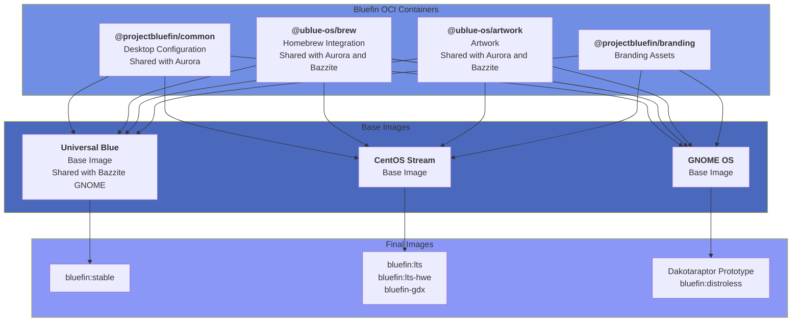

# Bluefin Contributor's Guide
### Welcome to [contribute.projectbluefin.io](https://contribute.projectbluefin.io)

This guide provides detailed instructions for contributing to [Bluefin](https://projectbluefin.io). Whether you're fixing bugs, adding features, or improving documentation, this guide will help you contribute effectively using the workflows established by the Bluefin team.

:::tip

You don't need permission to contribute to your own destiny.

-- Amber Graner

:::

## Getting Started

:::info First Time Contributing?
Start small! Documentation improvements or simple additions are great first contributions. Don't hesitate to ask questions in issues or discussions.
:::

## How Bluefin is Made

Bluefin is made via [lazy concensus](https://www.apache.org/foundation/glossary.html#LazyConsensus), which means that we trend towards "Just Do It" because if it was too crazy someone would say something. This is a nice casual way to open source, and is inspired by [Kubernetes](https://kubernetes.dev).

- Check [todo.projectbluefin.io](https://todo.projectbluefin.io/) to check work that is either new or in progress
- Check [done.projectbluefin.io](https://done.projectbluefin.io/) to check work that has recently been completed
- Items in Draft are
  - Things that need to happen but aren't claimed or specced out
  - Or transient things that don't need much planning like "Improve contributor guide" or "Fix up this just recipe". These are things that are identified as being needed but don't need much planning, "just send a sysadmin" style tasks.
- Convert a Draft task into an issue to design and specify something
  - Design and spec are for the good of the project and don't come with an implementation commitment. 

### Architecture

Bluefin's customization are kept in OCI containers, and are then assembled with other containers and base images to create the different Bluefin images:

### Things to know before diving in

> If you are reading this, then you may also be a Kubernetes nerd. You are the target audience for Bluefin. Welcome!

### Lazy Consensus Model

Bluefin follows a loose [Apache Lazy Consensus](https://community.apache.org/committers/decisionMaking.html):
- Assume consensus unless objections raised
- Allow time for feedback (account for timezones/holidays)
- Opinionated decisions encouraged
- Post issues for major changes requiring feedback and tag them with `enhancement`

Bluefin is a predator and may snap at you occasionally, and is opinionated for a reason:

- The userspace is mostly stable, we are not planning on making major changes to the layout - it's just the Ubuntu desktop. 
- Our **infrastructure velocity** comes from infrastructure work
  - This is the projects main focus because you can't deliver a product without the best infrastructure, [bootc](https://github.com/bootc-dev/bootc) is cloud native tech, we choose to build on it for a reason.
  - If you're "The Linux person on a Kubernetes platform team" this is the place for you
- Our **product velocity** comes from the workload
  - Ship a kickass GNOME experience and all the best upstream tech
  - Deliver a premiere cloud native developer experience
  - Abstract the operating system away from the user
- Sustainability is vital to the project
  - Sometimes not shipping a thing is better than the maintenance burden
- We tend to [say no](https://mikemcquaid.com/saying-no/)
  - But don't take it personally, we can't eat cheeseburgers every day, maybe someday. That's what brought you here!

## Overview

Bluefin is undergoing a refactor, this is the endstate, which we expect to finish by the end of 2025, but this is a good place to start. Bluefin is a combination of a set of configuration OCI containers which are then shipped on different images.

### Bluefin OCI containers

- Bluefin common: [@projectbluefin/common](https://github.com/projectbluefin/common) - Most of Bluefin's opinion is here
  - ujust, motd, service units, GNOME and CLI configuration, application choices, etc. Most things that have to do with the workload should live in this repo
- [@ublue-os/artwork](https://github.com/ublue-os/artwork) - Art assets
- Homebrew via an OCI: [@ublue-os/brew](https://github.com/ublue-os/brew) and associated [@ublue-os/homebrew-tap](https://github.com/ublue-os/homebrew-tap)

### Images 

- Bluefin stable and GTS: [@ublue-os/bluefin](https://github.com/ublue-os/bluefin) - generates Fedora-based Bluefin OCI container
- Bluefin LTS [@ublue-os/bluefin-lts](https://github.com/ublue-os/bluefin-lts) - generates a CentOS-based Bluefin OCI container
- Bluefin distroless prototype (aka Dakotaraptor) [@ublue-os/dakota](https://github.com/projectbluefin/dakota) - generates a GNOME OS based Bluefin OCI container

:::info Distroless
This is opposite of the traditional Linux distribution model, the value is in the other OCI layers, not the base image. This is what we mean by "distributions don't matter", since you can use any base image it's just another choice in the long list of decisions we have to make. It's still _important_, it just doesn't matter. And since you can source software from anywhere, the idea of "who gets you the same software better" doesn't make much sense when you can just automate that.
:::

## Understanding Bluefin's Architecture

The different components are then assembled in this order. This is done via GitHub actions and heavy use of Renovate to automate the entire build process:



### Image-Based Development

Bluefin uses OCI container images as the distribution mechanism. Every commit to the repository triggers builds that create bootable OS images. This architecture means:

### Build System

Bluefin images are built using:
- **Containerfile**: Defines the base image layers and build arguments
- **Build scripts**: Located in `build_files/` directory, organized by stage
- **GitHub Actions**: Automated workflows in `.github/workflows/`
- **Renovate Bot**: Automated dependency updates (60% of all commits)

We're making containers here with bash and a little bit of Python, it's not the space shuttle.

### Release Channels

| Channel | Purpose | Update Frequency | Fedora Version |
|---------|---------|------------------|----------------|
| **latest** | Daily builds | Multiple times per day | 43 (current) |
| **stable** | Weekly builds | Weekly | 43 |
| **gts** | Long-term support | As needed | 42 |

### Prerequisites

**Required Knowledge:**
- Git workflow basics
- Container concepts (Podman/Docker)
- Bash scripting fundamentals
- GitHub Actions basics (for CI/CD changes)

**Required Tools:**
- git 
- Text editor (VS Code, vim, etc.)
- GitHub account with 2FA enabled
- Podman or Docker (for local builds)

**Optional but Recommended:**
- Bluefin installation (for testing)
- Involvement the issues and understanding the problem before committing

### Fork and Clone

1. **Fork the repository** on GitHub to your account:
   ```bash
   # Navigate to https://github.com/ublue-os/bluefin
   # Click "Fork" in the upper right
   ```

2. **Clone your fork**:
   ```bash
   git clone https://github.com/YOUR_USERNAME/bluefin.git
   cd bluefin
   ```

3. **Add upstream remote**:
   ```bash
   git remote add upstream https://github.com/ublue-os/bluefin.git
   git fetch upstream
   ```

4. **Verify your setup**:
   ```bash
   git remote -v
   # Should show:
   # origin    https://github.com/YOUR_USERNAME/bluefin.git (fetch)
   # origin    https://github.com/YOUR_USERNAME/bluefin.git (push)
   # upstream  https://github.com/ublue-os/bluefin.git (fetch)
   # upstream  https://github.com/ublue-os/bluefin.git (push)
   ```

## Contribution Workflow

### Finding Work

- **[pullrequests.projectbluefin.io](https://pullrequests.projectbluefin.io)** - Pull Request reviews are always appreciated, even if you don't have permissions to merge you can help out by validating that the PR works and is tested.
- **[issues.projectbluefin.io](https://issues.projectbluefin.io)** - Participation and triage of issues is always appreciated!

#### Common Contribution Areas

- 🐛 **Bug fixes**: Issues labeled `bug`
- 📦 **Package additions**: Issues labeled `enhancement`
- 📝 **Documentation**: Issues labeled `documentation`
- 🔧 **Build improvements**: Issues labeled `just` or `github_actions`
- 🎨 **Developer features**: Issues labeled `dx`

### Branching Strategy

1. **Always branch from main**:
   ```bash
   git checkout main
   git pull upstream main
   ```

2. **Create a descriptive feature branch**:
   ```bash
   # For a bug fix
   git checkout -b fix/cockpit-startup-crash

   # For a feature
   git checkout -b feat/add-bazaar-integration

   # For documentation
   git checkout -b docs/improve-local-build-guide

   # For chores/maintenance
   git checkout -b chore/update-copr-repos
   ```

3. **Branch naming conventions**:
   - `fix/`: Bug fixes
   - `feat/`: New features
   - `docs/`: Documentation changes
   - `chore/`: Maintenance tasks
   - `refactor/`: Code refactoring

### Making Changes

#### File Structure Overview

```
bluefin/
├── .github/
│   └── workflows/          # GitHub Actions CI/CD
│       ├── build-image-*.yml      # Image build workflows
│       ├── reusable-build.yml     # Shared build logic
│       └── clean.yml              # Cleanup workflows
├── build_files/
│   ├── base/               # Base image build scripts
│   ├── shared/             # Shared utilities and scripts
│   └── dx/                 # Developer edition scripts
├── system_files/
│   └── shared/             # Files copied into the image
├── flatpaks/               # Flatpak app lists
├── just/                   # Just recipes (ujust commands)
├── iso_files/              # ISO-specific configurations
├── packages.json           # Package manifest
└── Containerfile           # Main image definition
```

#### Common Change Types

**1. Adding a Package**

Edit `packages.json`:
```bash
vim packages.json
```

Add your package to the appropriate array:
```json
{
  "all": {
    "include": {
      "rpm": [
        "existing-package",
        "your-new-package"
      ]
    }
  }
}
```

**3. Adding a Just Recipe**

Create or edit a file in `just/`:
```bash
vim just/60-custom.just
```

Add your recipe:
```make
# Install custom development tool
install-custom-tool:
    #!/usr/bin/env bash
    set -euxo pipefail
    echo "Installing custom tool..."
    toolbox run sudo dnf install -y custom-tool
```

**4. Modifying Build Scripts**

Build scripts are numbered by execution order. Common scripts:
- `04-packages.sh`: Package installation
- `05-override-install.sh`: RPM overrides
- `07-base-image-changes.sh`: System modifications
- `17-cleanup.sh`: Cleanup operations

Always test your changes with a local build (see Testing section).

**5. Adding Flatpaks**

Edit the appropriate flatpak list file:
```bash
# For all Bluefin variants
edit flatpaks/bluefin-list.txt

# For DX variant only
edit flatpaks/bluefin-dx-list.txt
```

Add Flatpak IDs (one per line):
```
com.example.NewApp
```

### Commit Message Format

:::caution Important
Bluefin uses [Conventional Commits](https://www.conventionalcommits.org/) enforced by CI. Your PR will fail if commit messages don't follow this format!
:::

**Format:**
```
<type>(<scope>): <subject>

<body>

<footer>
```

**Types:**
- `feat`: New feature
- `fix`: Bug fix
- `docs`: Documentation changes
- `chore`: Maintenance tasks
- `refactor`: Code refactoring
- `test`: Testing additions/changes
- `style`: Code style changes
- `perf`: Performance improvements

**Examples from Actual Bluefin Commits:**

```bash
# Simple fix
git commit -m "fix: remove cockpit and brew setup functions"

# Feature addition
git commit -m "feat: add bazaar flatpak to default installation"

# Chore with scope
git commit -m "chore(deps): update ghcr.io/ublue-os/silverblue-main:latest docker digest to 9168d7d"

# Documentation
git commit -m "docs: explain hat wobble"

# Multi-line with explanation
git commit -m "fix: Remove unused terminal and VFIO configurations

These configurations were causing conflicts with default GNOME settings
and are no longer needed with the updated kernel modules."
```

**Commit Message Tips:**
- Keep subject line under 72 characters
- Use imperative mood ("add" not "added" or "adds")
- Don't end subject line with a period
- Provide context in the body for complex changes
- Reference issues with `Fixes #123` or `Closes #456`

### AI Agent Attribution

AI agents must disclose the tool and model used in the commit footer with an "Assisted-by" trailer. The `AGENTS.md` used in Bluefin's repo will tell your agent to enforce this policy:

```
Assisted-by: [Model Name] via [Tool Name]
```

Example:

```text
Assisted-by: Claude 4.5 Opus via GitHub Copilot
```


### Making the Commit

```bash
# Stage your changes
git add path/to/modified/file.sh

# Or stage all changes
git add .

# Review what you're committing
git diff --cached

# Commit with message
git commit -m "feat(just): add custom development tool installer"

# Or use an editor for multi-line commits
git commit
```

### Pushing Changes

```bash
# Push to your fork
git push origin feat/add-bazaar-integration

# If you need to force push after amending (use with caution)
git push origin feat/add-bazaar-integration --force-with-lease
```

## Testing Your Changes

:::tip Testing is Key
Always test your changes locally or via PR builds before merging. Broken builds affect everyone!
:::

### Local Build Testing

**Option 1: Full Container Build** (Recommended for maintainers)

```bash
# Build the base image
podman build -t bluefin-test:latest .

# Build with specific arguments
podman build \
  --build-arg FEDORA_MAJOR_VERSION=42 \
  --build-arg IMAGE_NAME=bluefin \
  -t bluefin-test:latest \
  .
```

**Option 2: Script Testing** (Faster for script changes)

```bash
# Test a specific build script
podman run --rm -it \
  -v "$(pwd)/build_files:/build_files:ro" \
  ghcr.io/ublue-os/silverblue-main:42 \
  bash /build_files/base/04-packages.sh
```

**Option 3: GitHub Actions Build** (Use PR builds)

When you open a PR, GitHub Actions automatically builds your changes. Check the Actions tab for:
- Build logs
- Success/failure status
- Build artifacts

### Testing on Your System

:::warning Testing on Your System
Rebasing to PR images is powerful but comes with risk. Always have a backup plan to revert to stable!
:::

**Using PR Images:**

Every PR generates a test image. You can rebase to it:

```bash
# Find the PR number (e.g., #3322)
# Rebase to the PR image
sudo bootc switch ghcr.io/ublue-os/bluefin:pr-3322

# Reboot to test
sudo systemctl reboot

# If it works, leave feedback on the PR
# If it doesn't work, revert to stable
sudo bootc switch ghcr.io/ublue-os/bluefin:stable
sudo systemctl reboot
```

**Testing Just Recipes:**

```bash
# List available recipes
ujust

# Test your new recipe
ujust install-custom-tool

# Check for errors in the output
```

### Linting and Validation

**Shell Script Linting:**
```bash
# Install shellcheck if not present
brew install shellcheck

# Lint shell scripts
shellcheck build_files/base/*.sh
```

**Container Linting:**
```bash
# Use hadolint for Containerfile
podman run --rm -i hadolint/hadolint < Containerfile
```

**JSON Validation:**
```bash
# Validate packages.json
jq empty packages.json && echo "Valid JSON" || echo "Invalid JSON"
```

## Opening a Pull Request

### Pre-PR Checklist

- [ ] Code follows existing patterns in the repository
- [ ] Commit messages use Conventional Commits format
- [ ] Changes are tested (locally or via understanding of impact)
- [ ] Documentation updated if needed
- [ ] No unrelated changes included
- [ ] Branch is up-to-date with upstream main

### Creating the PR

1. **Push your branch** (if not already done):
   ```bash
   git push origin your-branch-name
   ```

2. **Open PR on GitHub**:
   - Navigate to https://github.com/ublue-os/bluefin
   - Click "Pull requests" → "New pull request"
   - Click "compare across forks"
   - Select your fork and branch
   - Click "Create pull request"

3. **Fill out PR description**:

```markdown
## Description
Brief description of what this PR does.

## Type of Change
- [ ] Bug fix
- [ ] New feature
- [ ] Documentation update
- [ ] Code refactoring
- [ ] Build/CI improvement

## Testing Done
- Local build: Yes/No
- Tested on running system: Yes/No
- Just recipes tested: Yes/No

## Related Issues
Fixes #123
```

### PR Review Process

**What Happens Next:**
1. **Automated checks run**: CI builds your changes
2. **Size label applied**: PR size labeled automatically (XS, S, M, L, XL)
3. **Maintainer review**: Usually within 24-48 hours
4. **Feedback addressed**: Make changes if requested
5. **Approval and merge**: Once approved, maintainers merge, rinse and repeat!

**During Review:**

If changes are requested:
```bash
# Make the requested changes
vim path/to/file

# Commit the changes
git add path/to/file
git commit -m "fix: address review feedback on error handling"

# Push to update the PR
git push origin your-branch-name
```

**After Merge:**

```bash
# Switch back to main
git checkout main

# Pull the latest changes
git pull upstream main

# Update your fork
git push origin main

# Delete your feature branch
git branch -d your-branch-name
git push origin --delete your-branch-name
```

## Advanced Workflows

:::note Advanced Git Techniques
These workflows are for more experienced contributors. New contributors should focus on the basics first!
:::

### Working with Renovate Bot

We strive to automate as much as we can, which means lazily spending our time watching the machine hum. Renovate runs every 30 minutes, and when a change is made in upstream Universal Blue everything rebuilds, it takes about an 30 minutes to 2 hours for a merged fix or feature to go live, depending on where in the chain the fix was needed. 

**Understanding Renovate:**
- Renovate creates PRs for dependency updates automatically
- Updates include: base images, GitHub Actions, container digests
- Auto-merge is enabled for low-risk updates
- Accounts for 60% of all commits

**Common Renovate PRs:**
```
chore(deps): update ghcr.io/ublue-os/silverblue-main:latest docker digest to abc123
chore(deps): update softprops/action-gh-release digest to def456
```

**When Renovate Conflicts with Your PR:**
```bash
# Rebase on latest main
git checkout your-branch
git fetch upstream
git rebase upstream/main

# Resolve conflicts if any
git mergetool  # or manually edit files

# Continue rebase
git rebase --continue

# Force push (your PR, your branch)
git push origin your-branch --force-with-lease
```

### Multi-Commit PRs

For larger features:

```bash
# Create logical commits as you work
git add file1.sh
git commit -m "feat: add base functionality"

git add file2.sh
git commit -m "feat: add error handling"

git add file3.sh
git commit -m "docs: document new feature"

# Push all commits
git push origin your-branch
```

### Amending Commits

```bash
# Stage additional changes
git add forgotten-file.sh

# Amend the last commit
git commit --amend

# Or amend without changing message
git commit --amend --no-edit

# Force push with safety
git push origin your-branch --force-with-lease
```

### Cherry-Picking Changes

```bash
# Cherry-pick a commit from another branch
git cherry-pick abc123def

# Cherry-pick multiple commits
git cherry-pick abc123..def456

# Resolve conflicts if needed
git cherry-pick --continue
```

### Working with Upstream Changes

```bash
# Fetch upstream changes regularly
git fetch upstream

# Update main branch
git checkout main
git merge upstream/main

# Rebase feature branch
git checkout your-feature
git rebase main

# Or merge main into feature
git merge main
```

## Contribution Areas by Expertise

:::info Find Your Fit
Contributors come from diverse backgrounds. Whether you're a DevOps engineer, artist, hobbyist, homelabber, or documentation writer, there's a place for your skills in Bluefin!
:::

### For Cloud Native/DevOps Engineers

**Container Build Optimization:**
- Improve Containerfile layer caching
- Optimize build scripts for speed
- Reduce image size

**CI/CD Improvements:**
- Optimize GitHub Actions workflows
- Add build parallelization
- Improve artifact handling
- Cloudflare experts always appreciated!

### For Maintainers

**UDEV Rules:**
- Submit hardware enablement rules
- Test on various hardware
- Document hardware requirements

### For Shell Script Developers

**Build Script Improvements:**
- Enhance error handling
- Add progress indicators
- Improve script modularity
- Make more use of `gum`, `glow` for a nice CLI user experieance

**Just Recipe Development:**
- Maintain ujust commands
- Improve existing recipes
- Add user-friendly aliases, etc.

### For Documentation Writers

**Documentation Standards:**
- Use clear, concise language
- Avoid terms like "simply" or "easy" ([justsimply.dev](https://justsimply.dev/))
- Include practical examples
- Link to related documentation

### For Frontend/UX Developers

- Work upstream!

## Troubleshooting Guide

:::tip Common Issues & Solutions
Stuck? Check this section first. Most problems have been encountered before and have known solutions!
:::

### Build Failures

**Problem:** Build fails with package conflict
```
Error: package foo conflicts with bar
```

**Solution:**
1. Check if package is already included elsewhere
2. Add exclusion to packages.json
3. Check COPR repository compatibility

**Problem:** Git error during build
```
fatal: unable to access 'https://github.com/': Could not resolve host
```

**Solution:**
1. Check network connectivity in build environment
2. Verify GitHub Actions has network access
3. Check if rate-limited by GitHub

### Local Testing Issues

**Problem:** Podman build fails with permission error
```
Error: writing blob: adding layer with blob: permissions denied
```

**Solution:**
```bash
# Run with appropriate permissions
sudo podman build -t test .

# Or configure rootless podman
podman system migrate
```

**Problem:** Out of disk space during build
```
Error: no space left on device
```

**Solution:**
```bash
# Clean up podman storage
podman system prune -a

# Check disk space
df -h
```

### PR Issues

**Problem:** CI check failing - Conventional Commit validation
```
❌ Commit message does not follow Conventional Commits format
```

**Solution:**
```bash
# Amend the commit message
git commit --amend

# Update the PR
git push origin your-branch --force-with-lease
```

**Problem:** Merge conflict with main
```
CONFLICT (content): Merge conflict in packages.json
```

**Solution:**
```bash
# Fetch latest upstream
git fetch upstream

# Rebase on main
git rebase upstream/main

# Resolve conflicts manually
vim packages.json

# Mark as resolved
git add packages.json
git rebase --continue

# Force push
git push origin your-branch --force-with-lease
```

## Community Interaction

### Communication Channels

**GitHub Issues:**
- Primary venue for bug reports and feature requests
- Use issue templates when available
- Search existing issues before creating new ones

**Discord:**
- Real-time chat for quick questions
- Discord: Check [the documentation](https://docs.projectbluefin.io/communications/) for the server link
- **Remember:** Discord is for chat, not permanent documentation

**Discussion Forum:**
- [community.projectbluefin.io](https://community.projectbluefin.io/)
- Long-form discussions
- Support questions
- Community feedback

### Communication Best Practices

**DO:**
- ✅ Ask questions in issues for permanent record
- ✅ Search before asking
- ✅ Provide context and details
- ✅ Be patient with maintainer response times
- ✅ Help others when you can
- ✅ Thank contributors

**DON'T:**
- ❌ Use Discord for bug reports (file issues instead)
- ❌ Expect immediate responses
- ❌ Ping maintainers directly unless urgent
- ❌ Ask the same question in multiple channels
- ❌ Post "me too" comments without additional info

### Code of Conduct

All contributors must follow the [Universal Blue Code of Conduct](https://github.com/ublue-os/main?tab=coc-ov-file#readme).

**Key Points:**
- Be respectful and inclusive
- Welcome newcomers
- Focus on constructive feedback
- Report inappropriate behavior to `jorge.castro@gmail.com`

### Issue Capture Discipline

:::note Issue Capture Philosophy
Use Discord for rapid debugging, but always capture solutions in GitHub issues. This builds permanent, searchable knowledge for the community.
:::

From the contributing guide philosophy:

**The "Issue Capture" Pattern:**
1. **Use Discord for rapid iteration** - Debug quickly in chat
2. **Capture to text editor** - Copy important findings as you go
3. **File an issue** - Create permanent record of solution
4. **Edit and improve** - Clean up the issue description later

**Why This Matters:**
- Solves the problem once for everyone
- Creates searchable documentation
- Prevents asking the same question twice
- Builds institutional knowledge

**Example Flow:**
```
Discord: "Hey, package X is failing to install"
  ↓ (quick back-and-forth debugging)
  ↓ (copy findings to text editor)
  ↓
GitHub Issue: "Package X fails on Fedora 42 due to Y dependency"
  - Symptoms
  - Root cause
  - Solution
  - Related links
```

## Contributing to Infrastructure

### GitHub Actions Workflows

**Workflow Structure:**
- `build-image-*.yml`: Per-channel build triggers
- `reusable-build.yml`: Shared build logic
- `clean.yml`: Artifact cleanup
- `generate-release.yml`: Release notes

**Making Workflow Changes:**

```bash
# Edit workflow file
vim .github/workflows/build-image-stable.yml

# Validate syntax locally
# Use GitHub's workflow validator or:
yamllint .github/workflows/build-image-stable.yml

# Commit
git add .github/workflows/build-image-stable.yml
git commit -m "chore(ci): improve stable build caching"

# Test in your fork first
git push origin your-branch
# Open PR from fork to see if it works
```

**Common Workflow Patterns:**

```yaml
# Conditional execution
- name: Build only on main
  if: github.ref == 'refs/heads/main'
  run: ./build.sh

# Matrix builds
strategy:
  matrix:
    variant: [bluefin, bluefin-dx]
    fedora: [42, 43]
```

### Build Script Development

**Script Organization:**
- `00-09`: Early stage (kernel, repos, packages)
- `10-16`: Mid stage (configuration, additions)
- `17-19`: Late stage (cleanup, initramfs)

**Script Template:**

```bash
#!/usr/bin/bash
set -eoux pipefail

echo "::group:: Your Script Name"

# Your logic here
# Use $FEDORA_MAJOR_VERSION for version-specific logic
# Use $IMAGE_NAME for image-specific logic

echo "::endgroup::"
```

**Testing Scripts:**

```bash
# Direct execution (for simple scripts)
bash -x build_files/base/04-packages.sh

# Container execution (more realistic)
podman run --rm -it \
  -v "$(pwd):/workspace:ro" \
  -e FEDORA_MAJOR_VERSION=42 \
  ghcr.io/ublue-os/silverblue-main:42 \
  bash /workspace/build_files/base/04-packages.sh
```

## Release Process

### Understanding Releases

Bluefin uses continuous delivery:
- **Daily builds**: Automatic, no manual release
- **Version format**: `42.20251012.1` (Fedora.YYYYMMDD.build)
- **Multiple builds per day**: Various channels updated independently

### Release Channels

**stable** (Weekly):
```bash
# Rebase to stable
sudo bootc switch ghcr.io/ublue-os/bluefin:stable
```

**latest** (Daily):
```bash
# Rebase to latest
sudo bootc switch ghcr.io/ublue-os/bluefin:latest
```

**gts** (LTS):
```bash
# Rebase to GTS (Long Term Support)
sudo bootc switch ghcr.io/ublue-os/bluefin:gts
```

## Pinning Package Versions

:::caution Temporary Workarounds Only
Package pins are temporary workarounds for upstream regressions. Always document why they exist and remove them after the fix is released!
:::

Sometimes upstream Fedora has a regression requiring a temporary pin.

**Add a Pin:**

Edit the appropriate Containerfile section:
```dockerfile
# Revert to older version of ostree to fix Flatpak installations
RUN rpm-ostree override replace \
    https://bodhi.fedoraproject.org/updates/FEDORA-2023-cab8a89753
```

**Document the Pin:**
```bash
# Add comment explaining:
# - What's pinned
# - Why it's pinned
# - Link to upstream bug
# - When to remove (after fix is released)
```

**Remove a Pin:**

Wait 24-48 hours after Fedora releases a fix (for rebuild propagation), then:
```bash
# Remove the override
git diff Containerfile
# Confirm the pin is removed
git commit -m "chore: remove ostree pin after upstream fix"
```

## Flatpak Management in Bluefin

### 1. Upstream to Flathub

Bluefin does not host its own Flatpak repository. All graphical applications must first be published on [Flathub](https://flathub.org/). To contribute a new Flatpak:

- Ensure your application meets [Flathub’s technical and legal requirements](https://docs.flathub.org/docs/for-app-authors/requirements).
- Prepare a Flatpak manifest and test local builds using `flatpak-builder`.
- Submit your application to Flathub by forking the [flathub/flathub](https://github.com/flathub/flathub) repository, creating a new branch, adding your manifest and required files, and opening a pull request against the `new-pr` branch. Follow the [submission guide](https://docs.flathub.org/docs/for-app-authors/submission).
- Respond to reviewer feedback and iterate as needed. Once approved, your app will be published on Flathub and available to Bluefin users.

### 2. Flatpak Quality and Maintenance

Maintain your Flatpak by following [Flathub’s maintenance guidelines](https://docs.flathub.org/docs/for-app-authors/maintenance). This includes updating runtimes, responding to build failures, and ensuring metadata quality. Applications that pass all quality checks are more likely to be featured both on Flathub and in downstream curated stores like Bazaar.

## Managing System Flatpaks in Bluefin

System-wide Flatpaks in Bluefin are managed through configuration files that list the Flatpak application IDs to be installed by default. These files are:

- `/etc/ublue-os/system-flatpaks.list` for standard system Flatpaks
- `/etc/ublue-os/system-flatpaks-dx.list` for developer mode Flatpaks

To propose changes (add, update, or remove Flatpaks):

1. Edit the relevant list file in the Bluefin repository (`flatpaks/system-flatpaks.list` or `flatpaks/system-flatpaks-dx.list`) and add or remove Flatpak IDs as needed. Each line should contain a single Flatpak app ID, for example:
   ```
   app/org.mozilla.firefox
   app/org.gnome.Calculator
   ```
2. Submit a pull request with your changes. Maintainers will review and merge as appropriate.

During system provisioning or updates, Bluefin installs or updates all Flatpaks listed in these files using the following logic:
```bash
flatpak remote-add --if-not-exists --system flathub https://flathub.org/repo/flathub.flatpakrepo
xargs flatpak --system -y install --or-update < /etc/ublue-os/system-flatpaks.list
# Developer mode Flatpaks are installed if developer mode is enabled
xargs flatpak --system -y install --or-update < /etc/ublue-os/system-flatpaks-dx.list
```
[Reference](https://github.com/ublue-os/bluefin/blob/3ddc76eaf5536f7340e34b2242131c2f7a455bd1/just/bluefin-system.just)

## Featuring Flatpaks in Bazaar

Bazaar’s featured sections are defined in a YAML configuration file:
`system_files/shared/usr/share/ublue-os/bazaar/config.yaml`

Each section (e.g., "Bluefin Recommends", "Browsers", "Media") contains an `appids` list specifying which Flatpaks appear in that section. To feature a Flatpak:

1. Ensure the Flatpak is available on Flathub and not present in the Bazaar blocklist (`system_files/shared/usr/share/ublue-os/bazaar/blocklist.txt`).
2. Edit `config.yaml` and add the Flatpak’s app ID to the `appids` list of the desired section. For example:
   ```yaml
   sections:
     - title: "Bluefin Recommends"
       appids:
         - org.mozilla.firefox
         - org.gnome.Calculator
         - com.example.YourApp   # <-- Add your app here
   ```
3. Optionally, create a new section if your application fits a new category.
4. Submit a pull request with your changes. The Bazaar maintainers will review and merge as appropriate.

[Reference](https://github.com/ublue-os/bluefin/blob/3ddc76eaf5536f7340e34b2242131c2f7a455bd1/system_files/shared/usr/share/ublue-os/bazaar/config.yaml)

## Lifecycle Management

### Updates

- Flatpaks are updated automatically from Flathub. When a new version is published on Flathub, Bluefin systems will receive the update during the next system Flatpak update cycle.
- To update a Flatpak’s version, update it on Flathub. No changes are needed in Bluefin unless the app ID changes or the app is removed.

### Removals

- To remove a Flatpak from Bluefin’s default install, delete its entry from the relevant system Flatpak list file and/or from Bazaar’s `config.yaml`.
- To remove a Flatpak from Flathub, follow [Flathub’s end-of-life process](https://docs.flathub.org/docs/for-app-authors/maintenance#end-of-life).

### Blocklisting

- Some Flatpaks are explicitly excluded from Bazaar via the `blocklist.txt` file. Do not add blocklisted app IDs to Bazaar’s featured sections.

### Maintenance Responsibility

- Flatpak maintainers are responsible for keeping their applications up to date on Flathub.
- Bluefin maintainers review and merge changes to system Flatpak lists and Bazaar configuration.

## Fedora Upstream Reporting

### When to Report Upstream

If you find a bug that:
- Exists in vanilla Fedora Silverblue/Kinoite
- Is not caused by Bluefin modifications
- Affects the base Fedora Atomic system

### How to Report Upstream

1. **Reproduce on vanilla Fedora** (if possible):
   ```bash
   # Boot vanilla Fedora Silverblue
   # Test if the issue occurs there
   ```

2. **Report to Fedora**:
   - Upstream tracker: [fedora-silverblue/issue-tracker](https://github.com/fedora-silverblue/issue-tracker/issues)
   - Include: Fedora version, steps to reproduce, logs

3. **Link in Bluefin Issue**:
   - Cross-reference the upstream issue
   - Track upstream progress
   - Help test fixes

## Maintainer Notes

### Becoming a Maintainer

Contributing regularly and demonstrating expertise may lead to maintainer status. Qualities valued:
- Consistent quality contributions
- Good communication
- Helpful to other contributors
- Understands project goals
- Reliable and responsive

**Current Maintainer Structure:**

- [Current Core Team](https://github.com/orgs/projectbluefin/people)


## Additional Resources

### Documentation

- [Bluefin Documentation](https://docs.projectbluefin.io/)
- [Building Locally](https://docs.projectbluefin.io/local)
- [Universal Blue Guide](https://universal-blue.org/guide/)
- [Fedora Atomic Documentation](https://docs.fedoraproject.org/en-US/fedora-silverblue/)

### Tooling

- [Conventional Commits](https://www.conventionalcommits.org/)
- [Just Command Runner](https://github.com/casey/just)
- [Podman Documentation](https://docs.podman.io/)
- [GitHub Actions Documentation](https://docs.github.com/en/actions)

The project welcomes all skill levels and contribution types. Start small, learn the workflows, and grow your involvement over time.

## Final Tips

:::tip Welcome to Bluefin!
Every maintainer started as a first-time contributor. Take it one step at a time, and don't be afraid to ask questions!
:::

1. **Start small**: Begin with documentation or simple fixes and additions
2. **Ask questions**: Don't hesitate to ask for clarification
3. **Test thoroughly**: Use local builds or PR images
4. **Be patient**: Reviews take time; maintainers balance multiple priorities
5. **Learn from others**: Read merged PRs to understand patterns
6. **Follow conventions**: Stick to established patterns in the codebase
7. **Document your work**: Help future contributors with clear explanations

Remember: Every maintainer started as a first-time contributor. Welcome to the Bluefin community!
