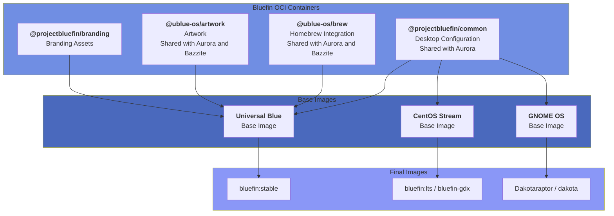

# Bluefin Contributor's Guide

### Welcome to [contribute.projectbluefin.io](https://contribute.projectbluefin.io)

:::tip

You don't need permission to contribute to your own destiny.

-- Amber Graner

:::

:::info First time contributing?
Start with documentation improvements or a small issue. Check [todo.projectbluefin.io](https://todo.projectbluefin.io/) for work that needs doing, and [done.projectbluefin.io](https://done.projectbluefin.io/) for recent completions.
:::

## How Bluefin is Made

Bluefin is an agentic factory: AI agents implement most of the work, and humans set direction, approve design, review PRs, and run the gates that machine enforcement cannot replace. Both are essential.

The factory is orchestrated by **[KubeStellar Hive](https://kubestellar.io/live/hive/bluefin/)**. Watch it work in real time at [hive.projectbluefin.io](/hive). For a deep dive into the factory model, see the **[Agentic Contributor Guide](/agentic-contributing)**.

Bluefin follows a loose [Apache Lazy Consensus](https://community.apache.org/committers/decisionMaking.html) model:
- Assume consensus unless someone objects
- Allow time for feedback across timezones
- Post issues for major changes and tag them `enhancement`
- [We tend to say no](https://mikemcquaid.com/saying-no/) — not personally, but sustainability matters more than feature count

## Architecture

Bluefin's customizations live in OCI containers that are assembled with base images to produce the final bootable OS images:


```mermaid
flowchart TB
    subgraph oci["Bluefin OCI Containers"]
        common["<strong>@projectbluefin/common</strong><br/>Desktop Configuration<br/>Shared with Aurora"]
        brew["<strong>@ublue-os/brew</strong><br/>Homebrew Integration<br/>Shared with Aurora and Bazzite"]
        artwork["<strong>@ublue-os/artwork</strong><br/>Artwork<br/>Shared with Aurora and Bazzite"]
        branding["<strong>@projectbluefin/branding</strong><br/>Branding Assets"]
    end

    subgraph base["Base Images"]
        ublue["<strong>Universal Blue</strong><br/>Base Image"]
        centos["<strong>CentOS Stream</strong><br/>Base Image"]
        gnome_base["<strong>GNOME OS</strong><br/>Base Image"]
    end

    subgraph images["Final Images"]
        bluefin["bluefin:stable"]
        lts["bluefin:lts / bluefin-gdx"]
        distroless["Dakotaraptor / dakota"]
    end

    common --> ublue
    common --> centos
    common --> gnome_base
    brew --> ublue
    artwork --> ublue
    branding --> ublue
    ublue --> bluefin
    centos --> lts
    gnome_base --> distroless

    style oci fill:#708ee3
    style base fill:#4a69bd
    style images fill:#8a97f7
```

Every commit triggers a build. Automated gates (E2E + 2-human approval + SHA-lock) promote `testing` → `stable`. Most of the work in [projectbluefin/common](https://github.com/projectbluefin/common) — desktop config, ujust recipes, GNOME opinions — is where human contributions have the most impact.

## Contributing Code

### Where to contribute

| Repo | What it controls | Good first areas |
|------|-----------------|-----------------|
| [projectbluefin/common](https://github.com/projectbluefin/common) | Desktop config, ujust recipes, GNOME defaults | ujust recipes, app defaults |
| [projectbluefin/bluefin](https://github.com/projectbluefin/bluefin) | Main Fedora-based image | Containerfile, build scripts |
| [projectbluefin/bluefin-lts](https://github.com/projectbluefin/bluefin-lts) | CentOS Stream LTS image | LTS-specific concerns |
| [projectbluefin/documentation](https://github.com/projectbluefin/documentation) | This docs site | Any page that's wrong or missing |

### PR workflow

PRs go against the `testing` branch. The factory promotes `testing` → `stable` after E2E passes and two humans approve.

```bash
git checkout -b feat/your-change
# make changes
git add .
git commit -m "feat(just): add new ujust recipe for X"
git push origin feat/your-change
# open PR against testing branch
```

### Commit messages

Bluefin uses [Conventional Commits](https://www.conventionalcommits.org/) — CI enforces this:

```
<type>(<scope>): <subject>
```

| Type | Use for |
|------|---------|
| `feat` | New feature or behavior |
| `fix` | Bug fix |
| `docs` | Documentation only |
| `chore` | Maintenance, deps, CI |
| `refactor` | Code change that isn't a fix or feature |

Examples:
```bash
git commit -m "feat: add bazaar flatpak to default installation"
git commit -m "fix: remove conflicting GNOME extension default"
git commit -m "chore(deps): update base image digest"
```

AI agents must include an attribution trailer:
```
Assisted-by: Claude Sonnet 4.6 via GitHub Copilot
```

### Testing your changes

Every PR builds a test image. Rebase to it to test on your real machine:

```bash
# Replace 3322 with your PR number
sudo bootc switch ghcr.io/projectbluefin/bluefin:pr-3322
sudo systemctl reboot
# If it works, approve the PR
# To revert:
sudo bootc switch ghcr.io/projectbluefin/bluefin:stable
```

## Managing Flatpaks

### Adding a system Flatpak

System Flatpaks are listed in `flatpaks/system-flatpaks.list` (or `flatpaks/system-flatpaks-dx.list` for developer mode). Add the Flatpak ID, one per line:

```
app/org.example.YourApp
```

The app must be on [Flathub](https://flathub.org/) first. If it isn't, [submit it there](https://docs.flathub.org/docs/for-app-authors/submission) — Bluefin does not host its own Flatpak repository.

### Featuring a Flatpak in Bazaar

Bazaar's curated sections are defined in:
`system_files/shared/usr/share/ublue-os/bazaar/config.yaml`

Add the app ID to the `appids` list of the relevant section and open a PR. The app must not be on the Bazaar blocklist.

## The Four Human Gates

Agents implement autonomously **except** at these gates — where human judgment is required:

| Gate | When | What to do |
|------|------|-----------|
| **Design Gate** | Architecture changes, new subsystems, user-visible behavior changes | Open a draft PR or issue first. Wait for approval before building. |
| **Security Gate** | Auth, signing, supply chain, secrets, third-party sources | Stop. Post what you found. Do not implement until a maintainer approves. |
| **Breakage Gate** | Cross-repo breaking changes | Enumerate affected repos. Open an issue before touching code. |
| **Merge Gate** | Final PR approval — always human | Two distinct humans for production builds (machine-enforced). |

See the **[Agentic Contributor Guide](/agentic-contributing)** for the full gate model, skill file conventions, and how to work alongside agents.

## Contributing to Docs

The docs site ([projectbluefin/documentation](https://github.com/projectbluefin/documentation)) runs Docusaurus. To contribute:

```bash
git clone https://github.com/projectbluefin/documentation.git
cd documentation
npm install --legacy-peer-deps
npm run start   # http://localhost:3000
```

Edit files in `docs/`, commit, and open a PR. TypeScript and ESLint must pass (`npm run typecheck && npm run lint`).

## Community

| | |
|---|---|
| **Chat** | [Discord](https://discord.gg/WEu6BdFDtp) |
| **Discussions** | [GitHub Discussions](https://github.com/ublue-os/bluefin/discussions) |
| **Questions** | [ask.projectbluefin.io](https://ask.projectbluefin.io) |
| **Feedback** | [feedback.projectbluefin.io](https://feedback.projectbluefin.io) |
| **PR queue** | [pullrequests.projectbluefin.io](https://pullrequests.projectbluefin.io) |
| **Work queue** | [todo.projectbluefin.io](https://todo.projectbluefin.io/) |
